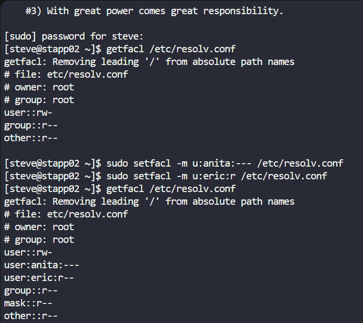

After conducting a security audit within the Stratos DC, the Nautilus security team discovered misconfigured permissions on critical files. To address this, corrective actions are being taken by the production support team. Specifically, the file named /etc/resolv.conf on Nautilus App 2 server requires adjustments to its Access Control Lists (ACLs) as follows:

1. The file's user owner and group owner should be set to root.

2. Others should possess read only permissions on the file.

3. User anita must not have any permissions on the file.

4. User eric should be granted read only permission on the file.

SOLUTION
1.ssh into the App Server 1: ssh tony@172.16.238.10

2. Check ACL of the file: getfacl /etc/hosts

3. sudo chmod o=r /etc/hosts

4. sudo setfacl -m u:yousuf:--- /etc/hosts

5. sudo setfacl -m u:eric:r /etc/hosts

Notes:
# owner: root: This line indicates that the owner of the file is the root user.
# group: root: This line indicates that the group owner of the file is the root group.
user::rw-: This line represents the permissions for the file owner (root). Here's what each character signifies:
user: Refers to the file owner.
::: Separates the user/group specification from the permissions.
rw-: Indicates that the owner has read (r) and write (w) permissions, but no execute (``) permission.
group::r--: This line represents the permissions for the group owner (root). Here's what each character signifies:
group: Refers to the group owner.
::: Separates the user/group specification from the permissions.
r--: Indicates that the group has read (r) permission, but no write () or execute () permission.
other::r--: This line represents the permissions for other users (users not in the owner group). Here's what each character signifies:
other: Refers to other users.
::: Separates the user/group specification from the permissions.
r--: Indicates that other users have read (r) permission, but no write () or execute () permission.